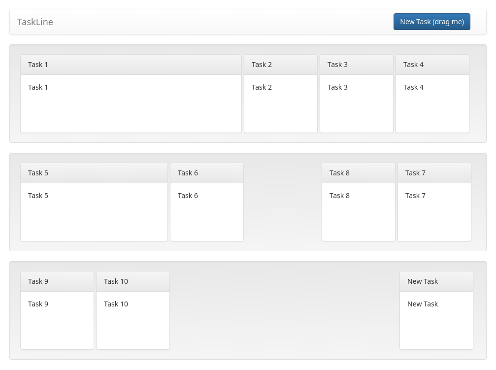

# TaskLine

* @Author: TimsManter
* @AuthorSite: [TimsManter.NET](http://timsmanter.net/)
* @CreateDate: 2017-07
* @Editor: Visual Studio Code
* @Language: TypeScript
* @Framework: React
* @Locale: en_US
* @License: [MIT](LICENSE.md)
* @Status: Dev | Active | Sample

## Overview

TaskLine is simple frontend-only task board example created using React framework, TypeScript and Webpack bundler.

## Screenshots

## Setup

- Clone repository: `git clone https://github.com/TimsManter/TM-W_TASKLINE_SPA_REA_TSX.git`
- Install npm packages: `npm install`
- Make sure you have Webpack and Dev Server installed
- Run dev server: `webpack-dev-server --open`